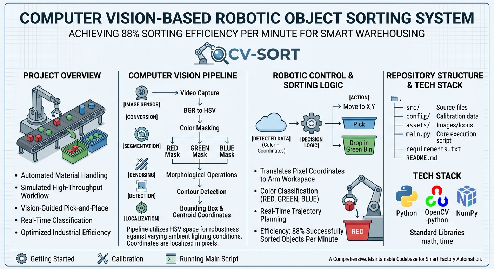

# Computer Vision-Based Robotic Object Sorting System

[](https://www.python.org/)
[](https://opencv.org/)
[](LICENSE)
[]()

<p align="center">
  
</p>

A real-time computer vision pipeline that enables a robotic arm to perceive, classify, and sort colored objects autonomously — engineered to simulate high-throughput industrial warehouse and manufacturing workflows.

## DEMO 

<p align="center">
  <a href="https://www.youtube.com/watch?v=LlqLGI17qpM" target="_blank">
    
  </a>
  <br>
  <em>Click the image above to watch the system tracking pipeline and robotic execution loop demo on YouTube.</em>
</p>

## Project Overview

Manual sorting and quality-control inspection remain major bottlenecks in modern manufacturing and warehousing pipelines. This project addresses that gap by implementing an end-to-end **vision-guided robotic sorting system** that detects, localizes, and classifies objects by color in real time, then translates that perception data into actionable robotic arm coordinates.

The system is designed with industrial automation principles in mind — low-latency processing, robustness to lighting variation, and deterministic decision logic — making it directly applicable to use cases such as:

- **Smart warehousing** — automated parcel/inventory sorting by category or color-coded labeling.
- **Manufacturing quality control** — defect or variant detection based on color/geometric deviation.
- **Pick-and-place automation** — reducing human intervention in repetitive sorting tasks.

### Key Features

- ⚙️ **88% sorting efficiency** — objects successfully identified, targeted, and sorted per minute under test conditions.
- 🎯 **Real-time HSV-based color segmentation** robust to ambient lighting fluctuations.
- 🔍 **Contour-based object detection** with noise-resilient morphological filtering.
- 📐 **Geometric localization** — bounding box and centroid extraction for precise coordinate mapping.
- 🤖 **Vision-to-motion translation layer** — converts pixel-space detections into robotic arm target coordinates.
- 🧩 **Modular pipeline architecture** — each processing stage is independently tunable and testable.
- 🧪 **Configurable color-class thresholds** for easy adaptation to new object sets without code changes.


## Computer Vision Pipeline

The system processes each video frame through a sequential, deterministic pipeline optimized for real-time throughput:

```
┌─────────────────┐     ┌──────────────────┐     ┌──────────────────────┐
│  Video Capture   │ --> │ BGR → HSV         │ --> │ Color Masking /       │
│  (Frame Stream)  │     │ Conversion         │     │ Segmentation          │
└─────────────────┘     └──────────────────┘     └──────────────────────┘
                                                              │
                                                              ▼
┌──────────────────────┐     ┌─────────────────┐     ┌──────────────────────┐
│ Bounding Box &        │ <-- │ Contour          │ <-- │ Morphological Ops     │
│ Centroid Localization │     │ Detection        │     │ (Noise Removal)       │
└──────────────────────┘     └─────────────────┘     └──────────────────────┘
            │
            ▼
   Coordinate + Color Class
   → Robotic Control Layer
```

### Stage Breakdown

1. **Video Capture** — Continuous frame acquisition from a calibrated camera feed (webcam or fixed industrial camera mount).
2. **BGR → HSV Conversion** — Each frame is converted from OpenCV's default BGR color space into HSV (Hue, Saturation, Value).
3. **Color Masking / Segmentation** — Binary masks are generated using `cv2.inRange()` against pre-calibrated HSV threshold ranges for each target color class.
4. **Morphological Operations (Noise Removal)** — Erosion and dilation (`cv2.erode`, `cv2.dilate`) clean the binary mask, eliminating small noise artifacts and closing gaps in detected object regions.
5. **Contour Detection** — `cv2.findContours()` extracts object boundaries from the cleaned mask, filtered by minimum contour area to discard spurious detections.
6. **Bounding Box & Centroid Localization** — For each valid contour, a bounding rectangle and centroid `(cx, cy)` are computed using image moments — this centroid becomes the spatial reference point passed to the robotic control layer.

### Why HSV Over RGB/BGR?

RGB/BGR encodes color as a tightly coupled combination of intensity and chromaticity — meaning even minor changes in ambient lighting, shadows, or reflections cause significant shifts across all three channels simultaneously, making consistent thresholding unreliable.

**HSV decouples chromaticity (Hue) from brightness (Value)**, allowing the system to:

- Threshold on **Hue** alone for stable color identification regardless of lighting intensity.
- Maintain detection accuracy under variable warehouse/factory lighting conditions.
- Simplify calibration — a single hue range robustly captures a color class across a wide range of illumination, rather than requiring per-lighting-condition recalibration of three coupled RGB channels.

This makes HSV segmentation significantly more production-viable for non-controlled industrial environments.

---

## Robotic Control & Sorting Logic

Once an object is localized, its centroid `(cx, cy)` and classified color label are passed to the **decision and control layer**, which performs the following:

1. **Color Classification** — The detected mask channel directly determines the object's sort category (e.g., Red → Bin A, Blue → Bin B, Green → Bin C).
2. **Pixel-to-World Coordinate Mapping** — The centroid's pixel-space coordinates are transformed into the robotic arm's physical workspace coordinates using a calibrated transformation (homography / linear mapping based on camera mounting geometry).
3. **Target Assignment** — Mapped coordinates are dispatched as pick-target commands, instructing the arm to move to the object's location.
4. **Pick-and-Sort Execution** — The arm executes a pick operation at the target coordinate and places the object into the bin corresponding to its classified color, completing the sort cycle.
5. **Cycle Loop** — The pipeline immediately re-evaluates the next frame, enabling continuous, queued sorting operations.

### Performance

| Metric | Result |
|---|---|
| **Sorting Efficiency** | **88%** objects successfully sorted per minute |
| **Detection Method** | HSV segmentation + contour-based localization |
| **Classification Basis** | Color class (extensible to shape/size in future iterations) |

This efficiency reflects the combined latency of the full vision-to-action loop — frame capture, segmentation, localization, coordinate transformation, and arm dispatch — validating the pipeline's viability for near-real-time industrial throughput.

---

## Repository Structure

```
robotic-object-sorting-system/
│
├── src/
│   ├── vision/
│   │   ├── preprocessing.py      # BGR-HSV conversion, masking, morphology
│   │   ├── detection.py          # Contour detection & localization
│   │   └── calibration.py        # HSV threshold calibration utilities
│   │
│   ├── control/
│   │   ├── coordinate_mapper.py  # Pixel-to-world coordinate transformation
│   │   └── sorting_logic.py      # Decision logic & arm command dispatch
│   │
│   └── utils/
│       ├── visualization.py      # Debug overlays, bounding boxes, FPS counter
│       └── logger.py             # Performance & event logging
│
├── config/
│   ├── color_thresholds.yaml     # HSV range definitions per color class
│   └── system_config.yaml        # Camera, arm, and pipeline parameters
│
├── assets/
│   ├── demo/                     # Demo images/GIFs of sorting in action
│   └── diagrams/                 # Pipeline & architecture diagrams
│
├── tests/
│   └── test_pipeline.py          # Unit tests for vision pipeline stages
│
├── main.py                       # Entry point — runs the full sorting pipeline
├── LICENSE
└── README.md
```

## Tech Stack & Dependencies

**Language**
- Python 3.8+

**Core Libraries**
- [`opencv-python`](https://pypi.org/project/opencv-python/) — image acquisition, color space conversion, contour/morphology operations
- [`numpy`](https://pypi.org/project/numpy/) — array operations and matrix transformations for coordinate mapping
- `math`, `time` (standard library) — geometric calculations and pipeline performance timing

---
## Getting Started

### Prerequisites

- Python 3.8 or higher
- A connected webcam or industrial camera (USB/RTSP supported)
- Adequate, reasonably consistent lighting for initial HSV calibration
- (Optional) Robotic arm hardware/simulator interface configured per `config/system_config.yaml`

### Installation

```bash
# Clone the repository
git clone https://github.com/<your-username>/robotic-object-sorting-system.git
cd robotic-object-sorting-system

# Create and activate a virtual environment
python -m venv venv
source venv/bin/activate      # On Windows: venv\Scripts\activate

# Install dependencies
pip install -r requirements.txt
```

### Usage

**1. Calibrate color thresholds**

Run the calibration utility to determine accurate HSV ranges for your specific objects and lighting conditions:

```bash
python src/vision/calibration.py
```

Adjust the HSV trackbars until only the target object is visible in the mask preview, then save the resulting range to `config/color_thresholds.yaml`.

**2. Run the main sorting pipeline**

```bash
python main.py
```

This launches the live video feed, runs the full detection → localization → sorting decision pipeline, and dispatches coordinates to the robotic arm (or simulation interface, if hardware is not connected).

**3. (Optional) Run in debug/visualization mode**

```bash
python main.py --debug
```

Displays bounding boxes, centroids, and classified labels overlaid on the live feed for pipeline verification and tuning.


## License

This project is licensed under the MIT License — see the [LICENSE](LICENSE) file for details.

## Contributing

Contributions, issues, and feature requests are welcome. Feel free to open an issue or submit a pull request.
